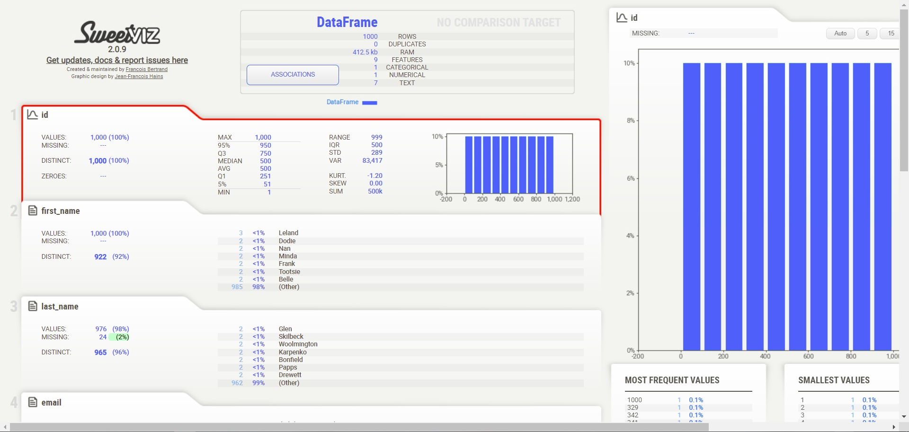
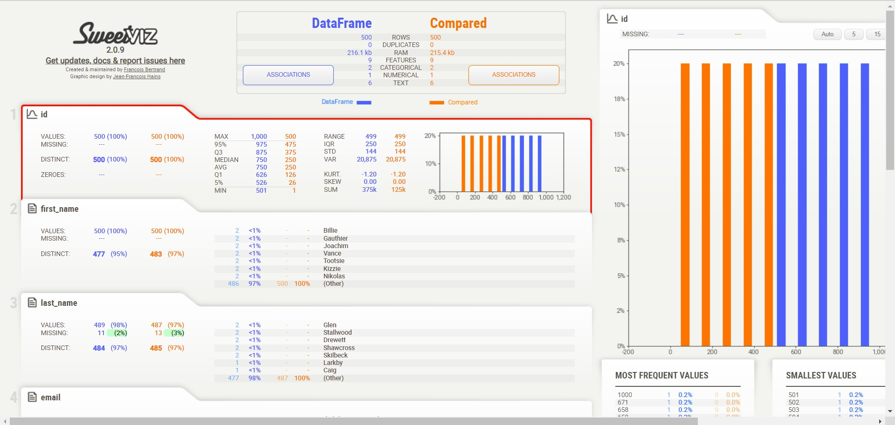

# Sweetviz Library

Sweetviz is an open-source Python library that generates visualizations to kickstart EDA (Exploratory Data Analysis).
This project aims to test Sweetviz library in data quality audit.

[](http://forthebadge.com) [](http://forthebadge.com)  [](http://forthebadge.com)  [](http://forthebadge.com)

## Getting started


1. Install sweetviz with pip

```bat
pip install sweetviz
```

2. Clone this project
3. Execute sample.py

### Screenshots





## Build with

* [Python](https://www.python.org/) - Programming language
* [Git](https://git-scm.com) - Open source distributed version control system
* [Mockaroo](https://www.mockaroo.com/) - Random Data Generator and API Mocking Tool

## Useful links or documents

* [Sweetviz](https://pypi.org/project/sweetviz/) - Open-source Pyhton library for EDA
* [Sweetviz Repository](https://github.com/fbdesignpro/sweetviz) - Thanks to [Francois Bertrand](https://github.com/fbdesignpro)

## Contributing

If you would like to contribute, read the CONTRIBUTING.md file to learn how to do so.
